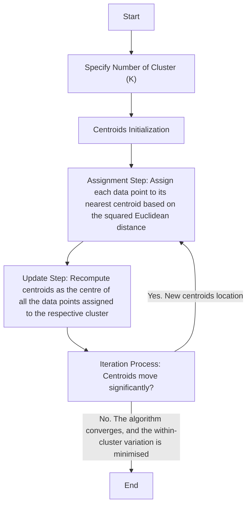
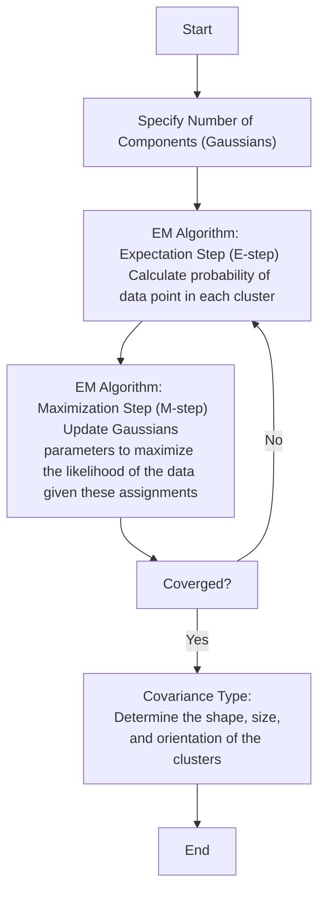

<a name="top"></a>
# AI4EO Week 4 Unsupervised Learning

<details>
  <summary><b>Table of Contents</b></summary>
  
- [Overview](#overview)
- [Getting Started](#getting-started)
  - [Prerequisite](#prerequisite)
- [Unsupervised Learning](#unsupervised-learning)
  - [K-Mean](#k-mean)
  - [Gaussian Mixture Models (GMM)](#gaussian-mixture-models-gmm)
- [Application](#application)
  - [Image Classification](#image-classification)
  - [Altimetry Classification](#altimetry-classification)
- [Visualisation](#visualisation)
- [Waveform Alignment Using Cross-Correlation](#waveform-alignment-using-cross-correlation)
- [Compare with ESA data](#compare-with-esa-data)
- [References](#references)
</details>

## Overview
In previous weeks, we used labelled images to perform supervised learning to classify sea ice and lead through Convolutional Neural Network, Random Forest and Vision Transformer. This week, we will adopt another approach: unsupervised learning. Unlike supervised learning, this approach does not require labelled datasets to learn; instead, it will discover structures or patterns in the data without prior instruction. In this project, we will first introduce the K-mean Clustering Algorithm and Gaussian Mixture Models. Then, apply these two classification methods on images from Sentinel-2 and altimetry data from Sentinel-3 to classify sea ice and lead. Lastly, the results will be compared with the classification by ESA. 
<p align="right">(<a href="#top">back to top</a>)</p>

## Getting Started
This project will be conducted on Google Colab, which provides free GPU access and allows storage via Google Drive. Alternatively, you may run it in a local environment, but this requires installing the necessary packages and ensuring sufficient computational resources. The project is based on the GEOL0069 Week 4 Jupyter Notebook Chapter1_Unsupervised_Learning_Methods.ipynb. 
### Prerequisite
To read the satellite data, you need to install the following packages before running the code:
```python
pip install rasterio
pip install netCDF4
```
Run the following codes to mount your Google Drive to the Jupyter Notebook.
```python
from google.colab import drive
drive.mount('/content/drive')
```
The Sentinel-2 images and Sentinel-3 altimetry data are sourced from the Copernicus Data Space and stored in the following directories:
```bash
S2A_MSIL1C_20190301T235611_N0207_R116_T01WCU_20190302T014622.SAFE
S3A_SR_2_LAN_SI_20190307T005808_20190307T012503_20230527T225016_1614_042_131______LN3_R_NT_005.SEN3
```
These directories are **not included** in this repository. 
<p align="right">(<a href="#top">back to top</a>)</p>

## Unsupervised Learning

### K-Mean
K-means clustering divides a dataset into k predefined groups (or clusters). It classifies the data points based on the similarity of the features of the data (MacQueen, 1967). The basic idea is to define k centroids, one for each cluster, and then assign each data point to the nearest centroid while keeping the centroids as small as possible.
#### Why K-means for Clustering?
- No prior knowledge about the data distribution or structure is needed, making it ideal for exploratory data analysis.<br>
- It is simple to implement and can scale to large datasets relatively easily.

#### Advantages of K-means
- High Computational Efficiency
- Easy to Interpret

#### Key Components of K-means and The Iterative Process


### Gaussian Mixture Models (GMM)
Gaussian Mixture Models (GMM) are a probabilistic model for representing normally distributed subpopulations within an overall population. The model assumes that the data is generated from a mixture of several Gaussian distributions, each with its own mean and variance (Reynolds, 2009). GMMs are widely used for clustering and density estimation, as they provide a method for representing complex distributions through the combination of simpler ones.
#### Why Gaussian Mixture Models for Clustering?
- It offers soft clustering and understanding of the uncertainties by providing the probability of each data point belonging to each cluster.
- Its flexibility in cluster covariance allows clusters to have different sizes and shapes to capture the true variance in the data.
#### Advantages of GMM
- Soft Clustering
- Cluster Shape Flexibility

#### Key Components of GMM and The Expectation-Maximization (EM) Algorithm


<p align="right">(<a href="#top">back to top</a>)</p>

## Application

### Image Classification
<p align="right">(<a href="#top">back to top</a>)</p>

### Altimetry Classification
<p align="right">(<a href="#top">back to top</a>)</p>

## Visualisation
<p align="right">(<a href="#top">back to top</a>)</p>

## Waveform Alignment Using Cross-Correlation
<p align="right">(<a href="#top">back to top</a>)</p>

## Compare with ESA data
<p align="right">(<a href="#top">back to top</a>)</p>

## References
<p align="right">(<a href="#top">back to top</a>)</p>
