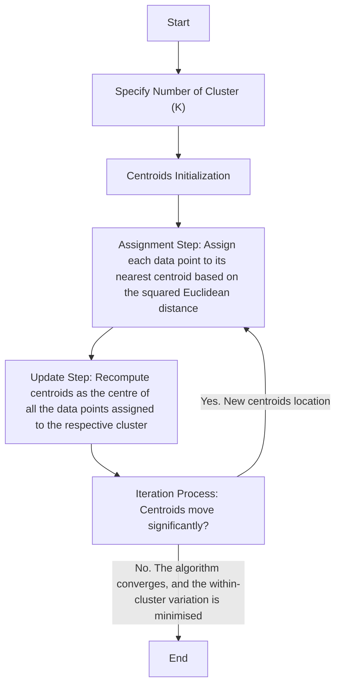

<a name="top"></a>
# AI4EO Week 4 Unsupervised Learning

<details>
  <summary><b>Table of Contents</b></summary>
  
- [Overview](#overview)
- [Getting Started](#getting-started)
  - [Prerequisite](#prerequisite)
- [Unsupervised Learning](#unsupervised-learning)
  - [K-Mean](#k-mean)
  - [Gaussian Mixture Models (GMM)](#gaussian-mixture-models-gmm)
- [Application](#application)
  - [Image Classification](#image-classification)
  - [Altimetry Classification](#altimetry-classification)
- [Visualisation](#visualisation)
- [Waveform Alignment Using Cross-Correlation](#waveform-alignment-using-cross-correlation)
- [Compare with ESA data](#compare-with-esa-data)
</details>

## Overview
In previous weeks, we used labelled images to perform supervised learning to classify sea ice and lead through Convolutional Neural Network, Random Forest and Vision Transformer. This week, we will adopt another approach: unsupervised learning. Unlike supervised learning, this approach does not require labelled datasets to learn; instead, it will discover structures or patterns in the data without prior instruction. In this project, we will first introduce the K-mean Clustering Algorithm and Gaussian Mixture Models. Then, use these two classification methods on images from Sentinel-2 and altimetry data from Sentinel-3 to classify sea ice and lead. Lastly, the results will be compared with the classification by ESA. 
<p align="right">(<a href="#top">back to top</a>)</p>

## Getting Started
This project will be conducted on Google Colab, which provides free GPU access and allows storage via Google Drive. Alternatively, you may run it in a local environment, but this requires installing the necessary packages and ensuring sufficient computational resources. The project is based on the GEOL0069 Week 4 Jupyter Notebook Chapter1_Unsupervised_Learning_Methods.ipynb. 
### Prerequisite
To read the satellite data, you need to install the following packages before running the code:
```python
pip install rasterio
pip install netCDF4
```
Run the following codes to mount your Google Drive to the Jupyter Notebook.
```python
from google.colab import drive
drive.mount('/content/drive')
```
The Sentinel-2 images and Sentinel-3 altimetry data are sourced from the Copernicus Data Space and stored in the following directories:
```bash
S2A_MSIL1C_20190301T235611_N0207_R116_T01WCU_20190302T014622.SAFE
S3A_SR_2_LAN_SI_20190307T005808_20190307T012503_20230527T225016_1614_042_131______LN3_R_NT_005.SEN3
```
These directories are **not included** in this repository. 
<p align="right">(<a href="#top">back to top</a>)</p>

## Unsupervised Learning

### K-Mean
K-means clustering partitions a dataset into a set of k groups (or clusters), where k represents the number of groups pre-specified by the analyst. It classifies the data points based on the similarity of the features of the data {cite}macqueen1967some. The basic idea is to define k centroids, one for each cluster, and then assign each data point to the nearest centroid while keeping the centroids as small as possible.
#### Why K-means for Clustering?
K-means clustering is particularly well-suited for applications where: <br>
- The structure of the data is not known beforehand: K-means doesn’t require any prior knowledge about the data distribution or structure, making it ideal for exploratory data analysis.<br>
- Simplicity and scalability: The algorithm is straightforward to implement and can scale to large datasets relatively easily.
#### Key Components of K-means and The Iterative Process

#### Advantages of K-means
- Efficiency: K-means is computationally efficient.
- Ease of interpretation: The results of k-means clustering are easy to understand and interpret.
<p align="right">(<a href="#top">back to top</a>)</p>

### Gaussian Mixture Models (GMM)
<p align="right">(<a href="#top">back to top</a>)</p>

## Application

### Image Classification
<p align="right">(<a href="#top">back to top</a>)</p>

### Altimetry Classification
<p align="right">(<a href="#top">back to top</a>)</p>

## Visualisation
<p align="right">(<a href="#top">back to top</a>)</p>

## Waveform Alignment Using Cross-Correlation
<p align="right">(<a href="#top">back to top</a>)</p>

## Compare with ESA data
<p align="right">(<a href="#top">back to top</a>)</p>
