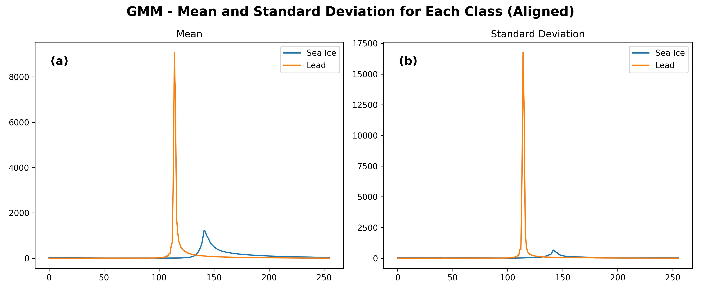

<a name="top"></a>
# AI4EO Week 4 Unsupervised Learning

<details>
  <summary><b>Table of Contents</b></summary>
  
- [Overview](#overview)
- [Getting Started](#getting-started)
  - [Prerequisite](#prerequisite)
- [Unsupervised Learning Methods](#unsupervised-learning-methods)
  - [K-Mean](#k-mean)
  - [Gaussian Mixture Models (GMM)](#gaussian-mixture-models-gmm)
- [Application](#application)
  - [Image Classification](#image-classification)
  - [Altimetry Classification](#altimetry-classification)
- [Waveform Alignment Using Cross-Correlation](#waveform-alignment-using-cross-correlation)
- [Assessment Part](#assessment-part)
  - [Average Echos and Standard Deviation](#average-echos-and-standard-deviation)
  - [Compare with ESA data](#compare-with-esa-data)
- [References](#references)
</details>

## Overview
In previous weeks, we used labelled images to perform supervised learning to classify sea ice and lead through Convolutional Neural Network, Random Forest and Vision Transformer. This week, we will adopt another approach: unsupervised learning. Unlike supervised learning, this approach does not require labelled datasets to learn; instead, it will discover structures or patterns in the data without prior instruction. In this project, we will first introduce the K-mean Clustering Algorithm and Gaussian Mixture Models. Then, these two classification methods were applied to images from Sentinel-2 and altimetry data from Sentinel-3 to classify sea ice and lead. Lastly, the results will be compared with the classification by ESA. Only the results are included in this README. Please go to the Jupyter Notebook for all the codes.
<p align="right">(<a href="#top">back to top</a>)</p>

## Getting Started
This project was conducted on Google Colab, which provides free GPU access and allows storage via Google Drive. Alternatively, you may run it in a local environment, but this requires installing the necessary packages and ensuring sufficient computational resources. The project was based on the GEOL0069 Week 4 Jupyter Notebook Chapter1_Unsupervised_Learning_Methods.ipynb. 
### Prerequisite
To read the satellite data, you need to install the following packages before running the code:
```python
!pip install rasterio
!pip install netCDF4
```
Run the following codes to mount your Google Drive to the Jupyter Notebook.
```python
from google.colab import drive
drive.mount('/content/drive')
```
The Sentinel-2 images and Sentinel-3 altimetry data are sourced from the Copernicus Data Space and stored in the following directories:
```bash
S2A_MSIL1C_20190301T235611_N0207_R116_T01WCU_20190302T014622.SAFE
S3A_SR_2_LAN_SI_20190307T005808_20190307T012503_20230527T225016_1614_042_131______LN3_R_NT_005.SEN3
```
These directories are **not included** in this repository. 
<p align="right">(<a href="#top">back to top</a>)</p>

## Unsupervised Learning Methods

### K-Mean
K-means clustering divides a dataset into k predefined groups (or clusters). It classifies the data points based on their similarity to the features of the data (MacQueen, 1967). The basic idea is to define k centroids, one for each cluster, and assign each data point to the nearest centroid while keeping the centroids as small as possible.
#### Why K-means for Clustering?
- No prior knowledge about the data distribution or structure is needed, making it ideal for exploratory data analysis.<br>
- It is simple to implement and can scale to large datasets relatively easily.

#### Advantages of K-means
- High Computational Efficiency
- Easy to Interpret

#### Key Components of K-means and The Iterative Process

<p align="right">(<a href="#top">back to top</a>)</p>

### Gaussian Mixture Models (GMM)
Gaussian Mixture Models (GMMs) are probabilistic models for representing normally distributed subpopulations within an overall population. The model assumes that the data is generated from a mixture of several Gaussian distributions, each with its own mean and variance (Reynolds, 2009). GMMs are widely used for clustering and density estimation, as they provide a method for representing complex distributions by combining simpler ones.
#### Why Gaussian Mixture Models for Clustering?
- It offers soft clustering and helps us understand the uncertainties by providing the probability that each data point belongs to each cluster.
- Its flexibility in cluster covariance allows clusters to have different sizes and shapes to capture the true variance in the data.
#### Advantages of GMM
- Soft Clustering
- Cluster Shape Flexibility

#### Key Components of GMM and The Expectation-Maximization (EM) Algorithm


<p align="right">(<a href="#top">back to top</a>)</p>

## Application

### Image Classification
In this example, we used three bands in Sentinel-2 imagery for the classification. The band images were stacked to create a mask with only non-zero values for both K-Mean and GMM.

#### K-Mean Implementation
The data was reshaped for the K-Mean implementation, and two clusters (k = 2) were defined. The result is shown below:
<p align="center">
  
</p>

#### GMM Implementation
The data was reshaped for the GMM implementation, and two components were defined. The result is shown below:
<p align="center">
  
</p>
<p align="right">(<a href="#top">back to top</a>)</p>

### Altimetry Classification
In this example, the altimetry dataset from Sentinel-3 was used to classify sea ice and lead. Since the waveform of the back-scattering radar depends on the surface type, the abrupt change in the surface properties of leads allows them to be detected through properties like peakiness and stack standard deviation (SSD) (von Albedyll et al., 2024).

<div align="center">
  <figure>
  <br>
  <figcaption style="text-align:center;">Representative waveforms of (a) leads and (b)sea ice (Lee et al., 2018)</figcaption>
  </figure>
</div>
<br>

The raw satellite dataset was first transformed into meaningful variables like peakiness and stack standard deviation. Then, the `NaN` values were removed before implementing K-Mean and GMM.

#### K-Mean Implementation
Similar to the image classification, two clusters were defined for the K-Mean Clustering. The K-Mean Algorithm would then classify the sea ice and leads into two clusters. The mean and standard deviation of the two clusters before alignment are shown below:
<div align="center">
  <figure>
  <br>
  <figcaption style="text-align:center;">The mean and standard deviation of the echos of sea ice and leads</figcaption>
  </figure>
</div>
<br> 

The echos from the altimetry dataset, as well as the classified echos, are shown below:
<div align="center">
  <figure>
  <br>
  <figcaption style="text-align:center;">True waveforms of radar echoes. (a) All echoes from the dataset, (b) echoes identified as leads, and (c) echoes identified as sea ice.</figcaption>
  </figure>
</div>
<br>
<div align="center">
  <figure>
  <br>
  <figcaption style="text-align:center;">Normalized waveforms of radar echoes. (a) All echoes from the dataset, (b) echoes identified as leads, and (c) echoes identified as sea ice.</figcaption>
  </figure>
</div>
<br>
Alternatively, the clustering result can be visualised by scatter plots:
<div align="center">
  <figure>
  <br>
  <figcaption style="text-align:center;">Scatter plots of GMM clustering results. (a) Backscatter coefficient (σ₀) vs Pulse Peakiness (PP), (b) Backscatter coefficient (σ₀) vs Stack Standard Deviation (SSD), and (c) Pulse Peakiness (PP) vs Stack Standard Deviation (SSD). The clusters are labelled as Sea Ice (blue) and Leads (red) based on GMM classification.</figcaption>
  </figure>
</div>

#### GMM Implementation
Similar to the image classification, two components were defined for the GMM. The GMM would then classify the sea ice and leads into two clusters. The mean and standard deviation of the two clusters before alignment are shown below:
<div align="center">
  <figure>
  <br>
  <figcaption style="text-align:center;">The mean and standard deviation of the echos of sea ice and leads</figcaption>
  </figure>
</div>
<br> 

The echos from the altimetry dataset, as well as the classified echos, are shown below:
<div align="center">
  <figure>
  <br>
  <figcaption style="text-align:center;">True waveforms of radar echoes. (a) All echoes from the dataset, (b) echoes identified as leads, and (c) echoes identified as sea ice.</figcaption>
  </figure>
</div>
<br>
<div align="center">
  <figure>
  <br>
  <figcaption style="text-align:center;">Normalized waveforms of radar echoes. (a) All echoes from the dataset, (b) echoes identified as leads, and (c) echoes identified as sea ice.</figcaption>
  </figure>
</div>
<br>
Alternatively, the clustering result can be visualised by scatter plots:
<div align="center">
  <figure>
  <br>
  <figcaption style="text-align:center;">Scatter plots of GMM clustering results. (a) Backscatter coefficient (σ₀) vs Pulse Peakiness (PP), (b) Backscatter coefficient (σ₀) vs Stack Standard Deviation (SSD), and (c) Pulse Peakiness (PP) vs Stack Standard Deviation (SSD). The clusters are labelled as Sea Ice (blue) and Leads (red) based on GMM classification.</figcaption>
  </figure>
</div>

<p align="right">(<a href="#top">back to top</a>)</p>

## Waveform Alignment Using Cross-Correlation
Due to the shifting of the sea ice, the altimetry data would also experience a positional shift. In order to produce a scientifically meaningful result, the altimetry data need to be aligned before averaging. In this example, the altimetry data was aligned by the peak using cross-correlation. 
### K-Mean
The aligned echos of all sea ice and leads are shown below:
<div align="center">
  <figure>
  <br>
  <figcaption style="text-align:center;">The aligned waveform of sea ice and leads for K-Mean Clustering.</figcaption>
  </figure>
</div>

### GMM
The aligned echos of all sea ice and leads are shown below:
<div align="center">
  <figure>
  <br>
  <figcaption style="text-align:center;">The aligned waveform of sea ice and leads for GMM.</figcaption>
  </figure>
</div>

<p align="right">(<a href="#top">back to top</a>)</p>

## Assessment Part
Tasks:
1. Classify the echoes in leads and sea ice and produce an average echo shape as well as standard deviation for these two classes 
2. Quantify your echo classification against the ESA official classification using a confusion matrix
### Average Echos and Standard Deviation
Recalculate the mean and standard deviation for both K-Mean and GMM with the aligned waveforms.
#### K-Mean
The result is shown below:
<div align="center">
  <figure>
  <br>
  <figcaption style="text-align:center;">The average echo shape and standard deviation of the two classes in aligned K-Mean classified waveforms.</figcaption>
  </figure>
</div>

#### GMM 
The result is shown below:
<div align="center">
  <figure>
  <br>
  <figcaption style="text-align:center;">The average echo shape and standard deviation of the two classes in aligned GMM classified waveforms.</figcaption>
  </figure>
</div>

<p align="right">(<a href="#top">back to top</a>)</p>

### Compare with ESA data
As the title suggests, the clustering results of K-Mean and GMM were compared with the classification of ESA, and the performances were visualised using confusion matrices.
#### K-Mean and GMM
<div align="center">
  <figure>
  <br>
  <figcaption style="text-align:center;">The confusion matrices for K-Means and GMM classifications against ESA reference labels.</figcaption>
  </figure>
</div>

<p align="right">(<a href="#top">back to top</a>)</p>

## References

Lee, S., Kim, H., & Im, J. (2018). Arctic lead detection using a waveform mixture algorithm from CryoSat-2 data. *The Cryosphere, 12*, 1665–1679. [https://doi.org/10.5194/tc-12-1665-2018](https://doi.org/10.5194/tc-12-1665-2018)

MacQueen, J. (1967). Some methods for classification and analysis of multivariate observations. *In Proceedings of the Fifth Berkeley Symposium on Mathematical Statistics and Probability, Volume 1: Statistics: Vol. 5.1* (pp. 281–298). University of California Press. [https://projecteuclid.org/ebooks/berkeley-symposium-on-mathematical-statistics-and-probability/Proceedings-of-the-Fifth-Berkeley-Symposium-on-Mathematical-Statistics-and/chapter/Some-methods-for-classification-and-analysis-of-multivariate-observations/bsmsp/1200512992](https://projecteuclid.org/ebooks/berkeley-symposium-on-mathematical-statistics-and-probability/Proceedings-of-the-Fifth-Berkeley-Symposium-on-Mathematical-Statistics-and/chapter/Some-methods-for-classification-and-analysis-of-multivariate-observations/bsmsp/1200512992)

Reynolds, D. (2009). Gaussian Mixture Models. *In S. Z. Li & A. Jain (Eds.), Encyclopedia of Biometrics* (pp. 659–663). Springer US. [https://doi.org/10.1007/978-0-387-73003-5_196](https://doi.org/10.1007/978-0-387-73003-5_196)

von Albedyll, L., Hendricks, S., Hutter, N., Murashkin, D., Kaleschke, L., Willmes, S., Thielke, L., Tian-Kunze, X., Spreen, G., & Haas, C. (2024). Lead fractions from SAR-derived sea ice divergence during MOSAiC. *The Cryosphere, 18*(3), 1259–1285. [https://doi.org/10.5194/tc-18-1259-2024](https://doi.org/10.5194/tc-18-1259-2024)

<p align="right">(<a href="#top">back to top</a>)</p>
